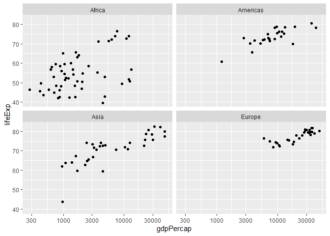
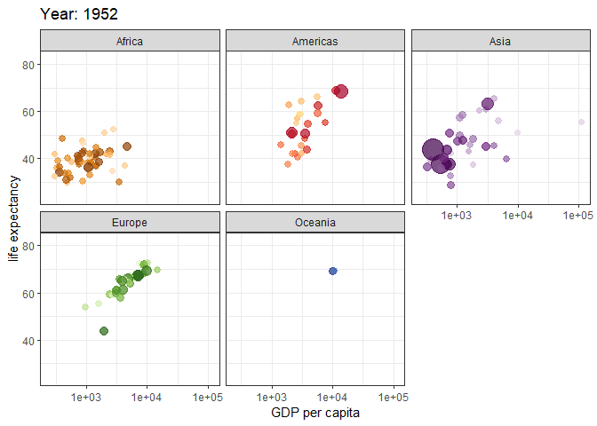

# Exploratory Data Analysis: Data Visualization - Customization

Requirements:

- GitHub account
- RStudio Cloud account

Goals:

<!-- - Create standard data visualizations  -->
<!-- - Use `ggplot2` functions to plot transformations  -->
<!-- - Add new layers to help make important information more visible  -->
<!-- - Add new layers to to summarize visual information -->

**Pick a lead**:
This person is not solely responsible for doing the activity, but they are responsible for organizing the collective team effort - for example, making sure all parts are completed and pushing them to the Team GitHub repo.

## Introduction

In this activity, we build on our foundational understanding of `ggplot2` to take more control of our visualizations.
I want to leave this activity more up to your creativity.
A great resource will be the [Data Visualization Cheat Sheet](https://www.rstudio.com/resources/cheatsheets/#ggplot2) created by RStudio.

<!-- In your first Application Task, you explored the `gapminder` data set. -->
<!-- In this activity, we will go through a methodical process of creating effective (easy for the audience to decode) visualizations. -->

## Getting started

We are still relying on only one Team Member (the lead) pushing the complete activity, but the others are expected to contribute to the discussion and help the lead member complete the step, but not *push* the files from their computer (they should be able to pull, though).

1. *All* Team Members:
  - Go to the Documents section on [Bb](https://mybb.gvsu.edu)
  - Click on the link titled `activity0204`
  - Click on the "Join" button next to your corresponding team name in the **Join an existing team** section
2. *All* Team Members now will:
  - In your team repo, click the green **Clone or download** button, select "Use HTTPS" if this isn't the default option, and click on the clipboard icon to copy the repo URL
  - Go to RStudio Cloud and into the course workspace.  Create a **New Project from Git Repo** - remember that you need to click on the down arrow next to the **New Project** button to see this option.
  - Paste the URL of your activity repo into the dialogue box.
  - Click "OK".
3. *All* Team Members now will Load Package:
  - In this lab, we will work with the `tidyverse` and `gapminder` packages so we need to install and load it.
    Type the following code into your *Console*:
  
    
    ```r
    install.packages("tidyverse")
    library(tidyverse)
    ```
    
    
    ```r
    install.packages("gapminder")
    library(gapminder)
    ```
    
  - Note that this package is also loaded in your R Markdown document.
4. *All* Team Members now will configure Git:
  - Go to the *Terminal* pane and type the following two lines of code, replacing the information inside the quotation marks with your GitHub account information:
  
    
    ```bash
    git config --global user.email "your email"
    git config --global user.name "your name"
    ```
    
  - Confirm that these changes have been implemented, run the following code:
  
    
    ```bash
    git config --global user.email
    git config --global user.name
    ```
        
  - Inform git that you want to store your GitHub credentials for $60 \times 60 \times 24 \times 7 = 604,800$ seconds, run the next line of code.  This needs to be done on a per-project basis.
  
    
    ```bash
    git config --global credential.helper 'cache --timeout 604800'
    ```
    
5. *All* Team Members will now name their RStudio project:
  - Currently your RStudio project is called *Untitled Project*.  Update the name of your project to be "Activity 2-4 - Data Visualization Intro"
6. The *Lead* Team Member to do the following in RStudio:
  - Open the `.Rmd` file and update the **YAML** by changing the author name to your **Team** name and date to today, then knit the document.
  - Go to the *Git* pane and click on **Diff** to confirm that you are happy with the changes.
  - *Stage* just your Rmd file, add a commit message like "Updated team name" in the *Commit Message* dialogue box and click **Commit**
  - Click on **Push**.  This will prompt a dialogue where you first need to enter your GitHub user name, and then your password - this should be the only time you need to do this for the current activity.
  - Verify that your changes have been made to your GitHub repo.
7. *All other* Team Members now will do the following in RStudio:
  - Go to the *Git* pane and click on **Pull** button.  This will prompt a dialogue where you first need to enter your GitHub user name, and then your password (this should be the only time you need to do this for the current activity).
  - Observe that the changes are now reflected in their project!

Again, only one team member will be pushing the changes.
All others are encouraged to work and save changes "locally" in RStudio.Cloud, but not push.

## The data

We continue using Jenny Bryan's (by way of Hans Rosling) `gapminder` data set.

## Data Visualization Customization

The following base visualization that I want you to improve is below.
I am going to avoid telling you specific things to do and have this be more of a creativity activity.
For each exercise, you are expected to point out what changes you made and explain why you think that make your visualization more effective.


```r
my_gm %>% 
  filter(year == "2007",
         continent != "Oceania") %>% 
  ggplot(aes(x = gdpPercap, y = lifeExp)) +
  scale_x_log10() + 
  geom_point() +
  facet_wrap(~ continent)
```

<!-- -->

### Titles

***
**Exercise 1**:
Using the `labs` layer, make this base visualization more informative.
You should at least update the axes labels and main title.

***

### Themes

***
**Exercise 2**:
Choose a `theme` layer (other than the default `theme_gray()`) to improve upon your visualization from Exercise 1.
If you so wish, additional themes can be found in the [`ggthemes` package](https://jrnold.github.io/ggthemes/reference/index.html) or build your own!

***

### Colors

***
**Exercise 3**:
Add color to the plot.
The `gapminder` package has two built in color schemes: `country_colors` and `continent_colors`.
You can use these or choose your own.

***

### User's choice

***
**Exercise 4**:
Add something else that we didn't cover in the previous exercises.

***

### A tease

<!-- -->
